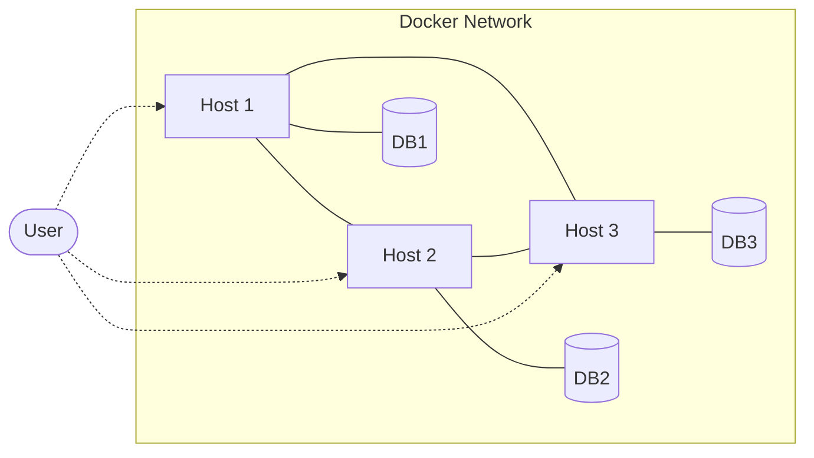

### Use case diagram

```mermaid
flowchart LR
    subgraph System["Messenger OLEG"]
        Send["Send Message"]
        Join["Join Channel"]
        Create["Create Channel"]
        Leave["Leave Channel"]
        View["View Messages"]
    end

    User(["User"])
    
    User --- Send
    User --- Join
    User --- Create
    User --- Leave
    User --- View
```
### Architecture

```mermaid
flowchart LR
    subgraph Network["Docker Network"]
        Host1["Host 1"]
        Host2["Host 2"]
        Host3["Host 3"]
        
        DB1[("DB1")]
        DB2[("DB2")]
        DB3[("DB3")]
        
        Host1 --- DB1
        Host2 --- DB2
        Host3 --- DB3
        
        Host1 --- Host2
        Host1 --- Host3
        Host2 --- Host3
    end

    User(["User"])
    
    User -.-> Host1
    User -.-> Host2
    User -.-> Host3
```
