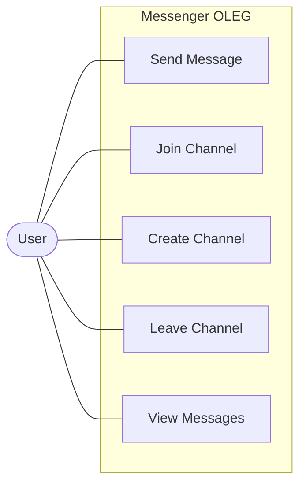
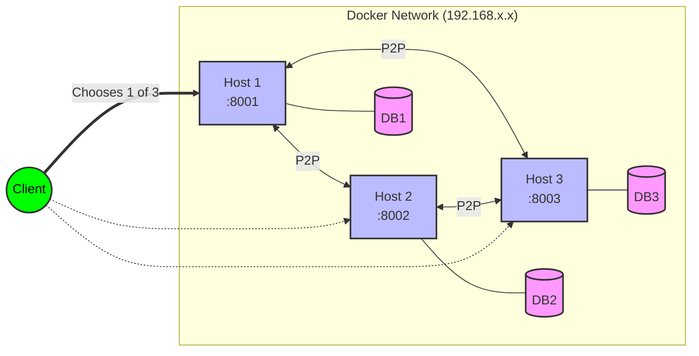

### Use case diagram

```mermaid
flowchart LR
    subgraph System["Messenger OLEG"]
        Send["Send Message"]
        Join["Join Channel"]
        Create["Create Channel"]
        Leave["Leave Channel"]
        View["View Messages"]
    end

    User(["User"])
    
    User --- Send
    User --- Join
    User --- Create
    User --- Leave
    User --- View
```
### Architecture

```mermaid
flowchart LR
    Client((Client))
    
    subgraph Network["Docker Network (192.168.x.x)"]
        direction TB
        
        H1[Host 1\n:8001]
        H2[Host 2\n:8002]
        H3[Host 3\n:8003]
        
        DB1[(DB1)]
        DB2[(DB2)]
        DB3[(DB3)]
        
        H1 --- DB1
        H2 --- DB2
        H3 --- DB3
        
        H1 <-->|P2P| H2
        H1 <-->|P2P| H3
        H2 <-->|P2P| H3
    end
    
    Client ==>|"Chooses 1 of 3"| H1
    Client -.-> H2
    Client -.-> H3
    
    style Client fill:#0f0,stroke:#333,stroke-width:2px,color:#000
    style H1 fill:#bbf,stroke:#333,stroke-width:2px
    style H2 fill:#bbf,stroke:#333,stroke-width:2px
    style H3 fill:#bbf,stroke:#333,stroke-width:2px
    style DB1 fill:#f9f,stroke:#333,stroke-width:2px
    style DB2 fill:#f9f,stroke:#333,stroke-width:2px
    style DB3 fill:#f9f,stroke:#333,stroke-width:2px
```
